# ExpensifyX 💸

<p align="center">
    
</p>

<p align="center">
  A modern, full-stack expense tracking application designed to help you take control of your finances with a clean, intuitive, and powerful interface.
</p>

<p align="center">
  <!-- Badges -->
  
  
  
  
</p>

<p align="center">
  <a href="https://expensifyx.site" target="_blank">
    
  </a>
</p>

<p align="center">
  <a href="#-key-features">Key Features</a> •
  <a href="#-tech-stack--tools">Tech Stack</a> •
  <a href="#️-project-structure">Project Structure</a> •
  <a href="#-quick-start-running-locally">Quick Start</a> •
  <a href="#-deployment">Deployment</a>
</p>

---

## ✨ Key Features

- **🔐 Secure Authentication**: Robust user sign-in and sign-up with Clerk, supporting both Email OTP and Google OAuth.
- **📊 Interactive Dashboard**: A central hub to view and filter transactions by account, providing a clear financial overview.
- **💸 Full Transaction Management**: Seamlessly add, edit, and delete income and expense records.
- **🔁 Recurring Transactions**: Set up recurring payments, and the app automatically calculates and displays the next occurrence date.
- **📄 Data Export**: Download your transaction history as a PDF or Excel file, with flexible date range filtering.
- **📱 Responsive & Modern UI**: Built with Tailwind CSS and shadcn/ui for a beautiful, consistent experience on any device.
- **🔒 Protected Routes**: Server-side middleware ensures that your financial data is always secure and private.
- **🚀 Optimized Performance**: Custom loading states, spinners, and optimized builds for a fast, smooth user experience.

## 📸 Screenshots

<details>
<summary>Click to view application screenshots</summary>
  

  ### Landing Page
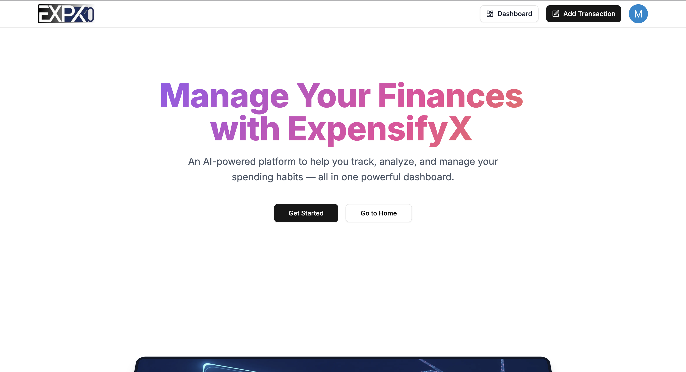

### Dashboard Page
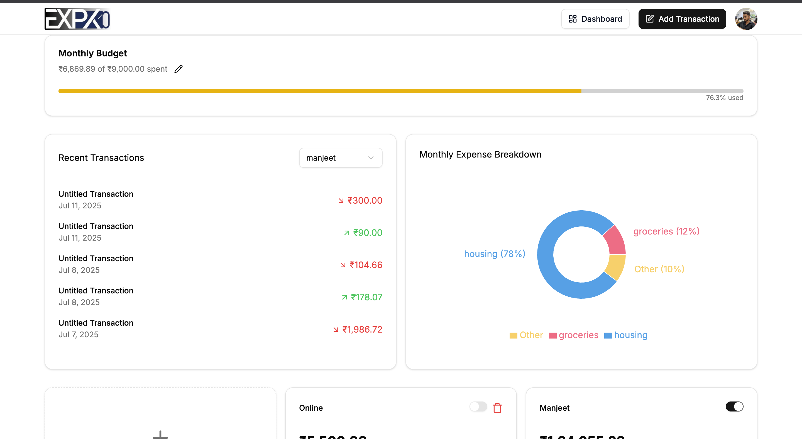

  ### Accounts & Transaction
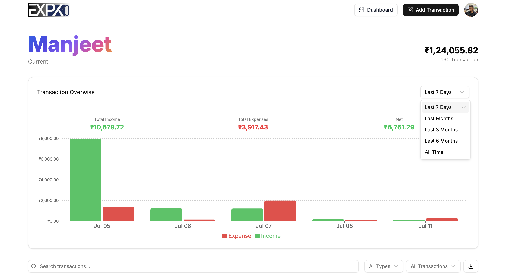
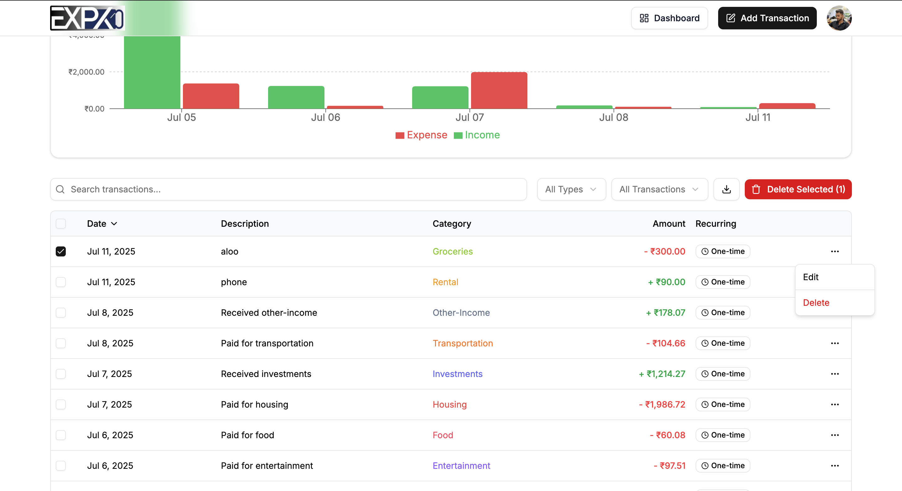

  ### Account Add view
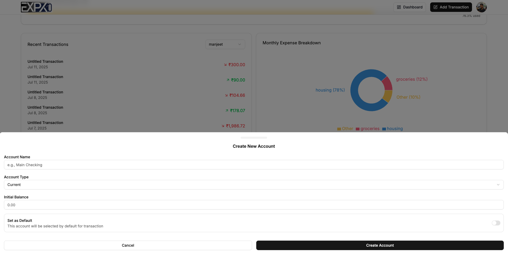

  ### Create Transaction
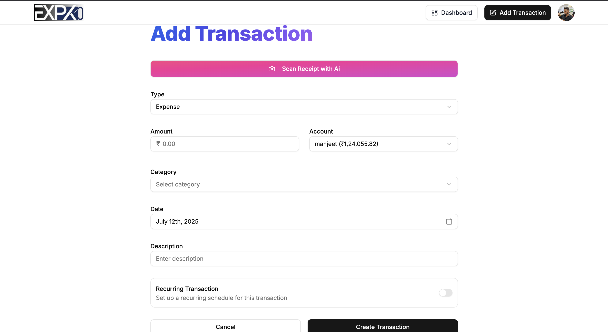


<br/><br/>
<br/>
<br/>
<br/>

# Mail ✉️

  ### Welcome Mail
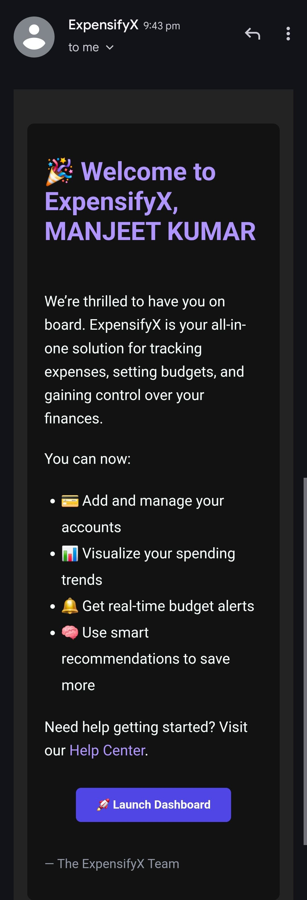

  ### Recurring Transaction
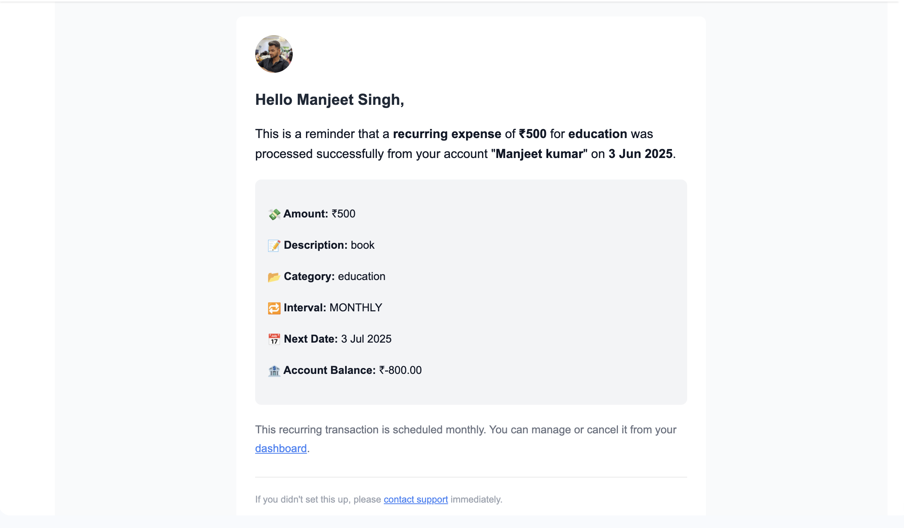

  ### Budget Alert
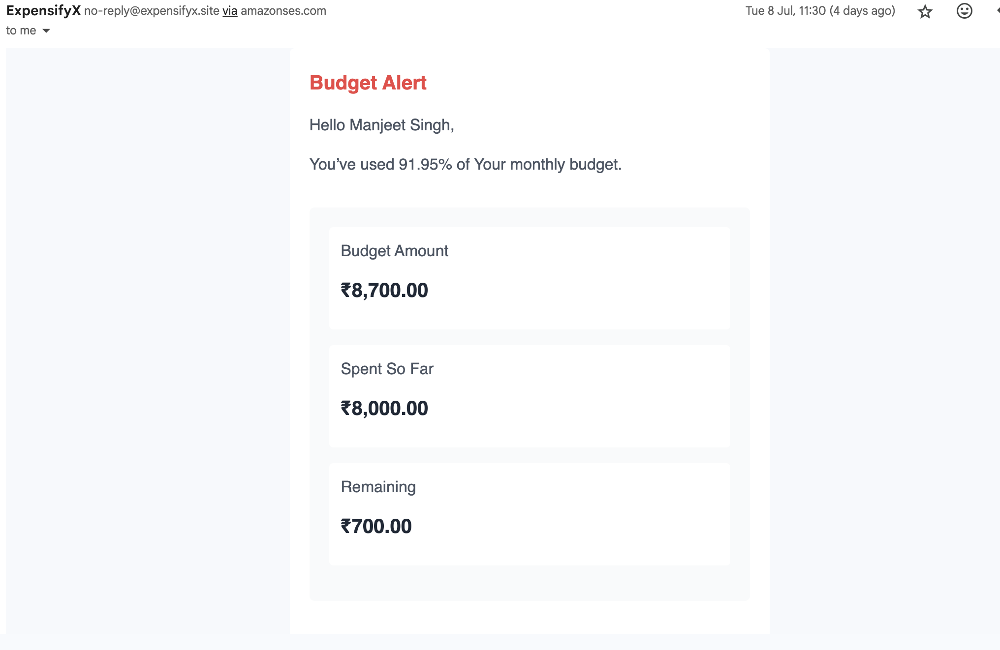

  ### Monthly report
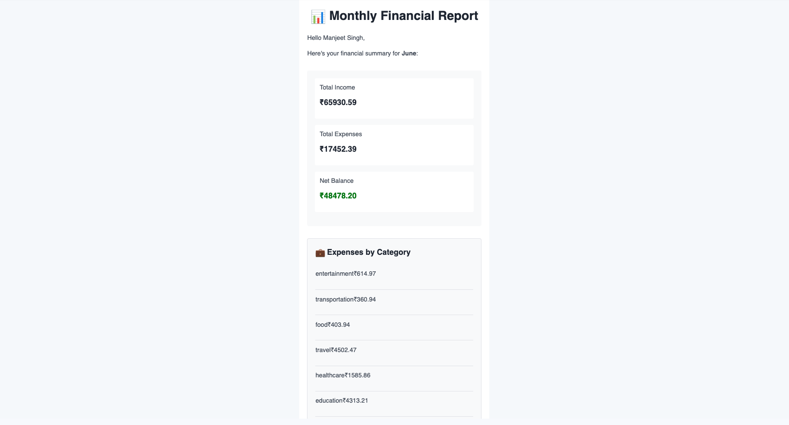
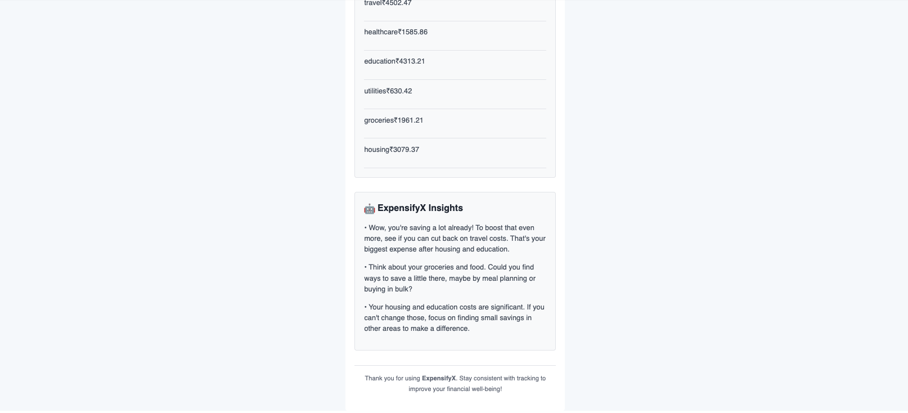

<!-- Add your screenshots here -->
<!-- Example: -->
<!--  -->
<!--  -->

</details>

---

## 🔧 Tech Stack & Tools

A curated list of modern technologies powering ExpensifyX:

<p align="left">
  <!-- Tech Badges -->
  
  
  
  
  
  
  
  
  
  
</p>

*   **Framework**: Next.js (App Router)
*   **ORM**: Prisma
*   **Database**: PostgreSQL
*   **Authentication**: Clerk
*   **Styling**: Tailwind CSS & shadcn/ui
*   **Form Management**: React Hook Form & Zod
*   **Email**: Resend
*   **File Export**: ExcelJS & PDFKit
*   **Date Handling**: date-fns
*   **Deployment**: Vercel

---

## 🏗️ Project Structure

The project follows a standard Next.js App Router structure, keeping code organized and scalable based on features.

```
expensifyx/
├── app/                # Next.js App Router: pages, layouts, and components
│   ├── (auth)/         # Authentication routes (sign-in, sign-up)
│   └── (main)/         # Protected routes for authenticated users
├── actions/            # Server Actions for data mutation (`use server`)
├── components/         # Shared/reusable UI components (shadcn/ui)
├── lib/                # Helper functions, utils, and library instances
└── prisma/             # Prisma schema and database migrations
```

---

## 🚀 Quick Start: Running Locally

Follow these steps to get the project up and running on your local machine.

### 1. Clone the Repository
```bash
git clone https://github.com/your-username/expensifyx.git
cd expensifyx
```

### 2. Install Dependencies
```bash
npm install
```

### 3. Set Up Environment Variables
Create a `.env` file in the root of the project by copying the example file:
```bash
cp .env.example .env
```
Then, fill in the required credentials for Clerk, Resend, and your PostgreSQL database.

```env
# .env

# Clerk Authentication (https://clerk.com)
NEXT_PUBLIC_CLERK_PUBLISHABLE_KEY="**********"
CLERK_SECRET_KEY="**********"
NEXT_PUBLIC_CLERK_SIGN_IN_URL=/sign-in
NEXT_PUBLIC_CLERK_SIGN_UP_URL=/sign-up

## Database (e.g., Vercel Postgres or Neon)
DATABASE_URL="*********************************"

## Resend (https://resend.com)
RESEND_API_KEY="***************"
```

### 4. Run Database Migrations
Apply the database schema to your PostgreSQL instance:
```bash
npx prisma migrate dev
```

### 5. Start the Development Server
```bash
npm run dev
```

Your application should now be running at `http://localhost:3000`.

---

## 📤 Deployment

This application is optimized for deployment on **Vercel**. Simply connect your GitHub repository to a new Vercel project.

1.  **Push to GitHub**: Ensure your code is pushed to a GitHub repository.
2.  **Import Project on Vercel**: Select your repository and let Vercel configure the build settings.
3.  **Add Environment Variables**: Add the same environment variables from your `.env` file to the Vercel project settings.
4.  **Deploy**: Vercel will automatically build and deploy your application. Future pushes to the `main` branch will trigger automatic redeployments.

---

## 🤝 Contributing

Contributions are what make the open-source community such an amazing place to learn, inspire, and create. Any contributions you make are **greatly appreciated**.

If you have a suggestion that would make this better, please fork the repo and create a pull request. You can also simply open an issue with the tag "enhancement". Don't forget to give the project a star! Thanks again!

1.  Fork the Project
2.  Create your Feature Branch (`git checkout -b feature/AmazingFeature`)
3.  Commit your Changes (`git commit -m 'Add some AmazingFeature'`)
4.  Push to the Branch (`git push origin feature/AmazingFeature`)
5.  Open a Pull Request

## 📜 License

This project is licensed under the **MIT License**. See the LICENSE file for more details.
